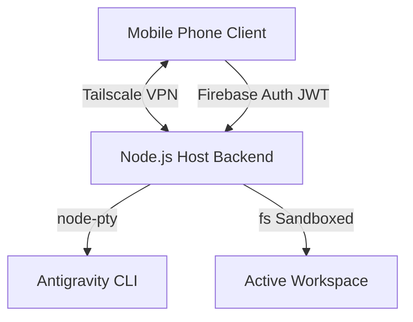

# Pocket-G: Secure Remote Antigravity Client

Pocket-G is a highly secure, zero-latency, stateless remote web client designed to control a macOS host running the Google Antigravity CLI from a mobile browser. It leverages a direct Tailscale VPN transport layer and runs in an ephemeral, memory-only execution state on the client to eliminate cloud storage risks.

## Core Features

- **Stateless Architecture**: No database, database logs, or chat histories are stored in the cloud. Client state is maintained strictly in mobile browser ephemeral RAM.
- **Firebase Token Verification**: Zero-trust authentication via Google Sign-In on Firebase Auth, verified securely on the Node.js backend using Firebase Admin SDK.
- **Command Blacklist & Path Sandboxing**: Keystrokes are buffered and screened against a strict blacklist regex (e.g., preventing unauthorized commands like `rm -rf` or `sudo`), and file lookups are sandboxed strictly under the configured `ACTIVE_WORKSPACE` directory.
- **Mobile-First UX**: Sleek, bottom-tabbed UI layout, responsive file system browser, custom xterm.js terminal integration, and an on-screen row of developer shortcut keys.
- **Auto-Kill Daemon**: Node.js backend automatically detects WebSocket client disconnections and terminates the underlying pseudo-terminal (`node-pty`) instantly.

## Architecture Overview



## Security Design

1. **Identity Gatekeeping**: Every connection attempts a JWT token exchange. The Node.js Express server validates the token with `firebase-admin` and enforces that the token email matches the configured `AUTHORIZED_EMAIL`.
2. **Terminal Keystroke Buffer**: Raw keystrokes are intercepted at the backend WebSocket layer. When a command is submitted (indicated by line termination), it is verified against blacklisted command patterns before being piped to `node-pty`.
3. **Sandbox Enforcement**: File reads and listings are validated to ensure paths remain strictly within the `ACTIVE_WORKSPACE` directory, preventing path traversal attacks.

## Setup Instructions

### Prerequisites
- Node.js (v18+)
- Firebase Account and Project
- Tailscale client installed and running on both Host (MacBook) and Client (Mobile)

### Installation

1. Clone the repository on your macOS host:
   ```bash
   git clone https://github.com/<your-username>/Pocket-G.git
   cd Pocket-G
   ```

2. Configure Backend:
   ```bash
   cd backend
   npm install
   cp .env.example .env
   # Add your Firebase service account details and AUTHORIZED_EMAIL to backend/.env
   ```

3. Configure Frontend:
   ```bash
   cd ../frontend
   # Configure Firebase project and hosting settings
   ```

4. Run Backend Server:
   ```bash
   node server.js
   ```

## License

Proprietary / Internal Google Antigravity Project.
